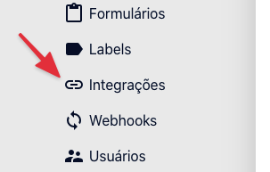
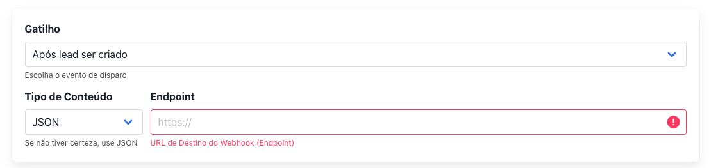
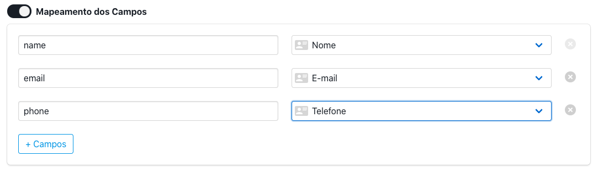
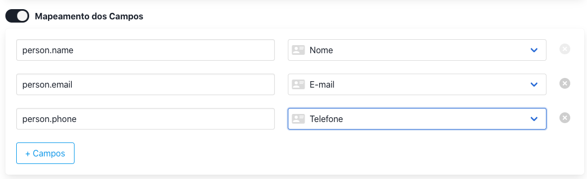
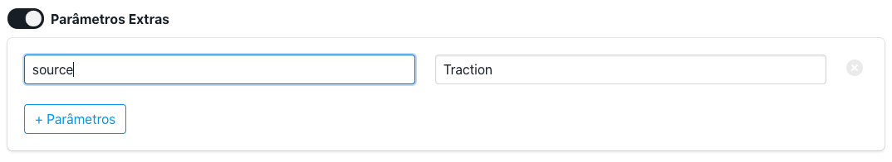
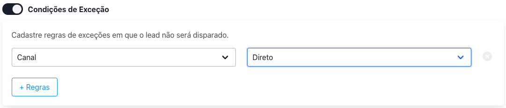
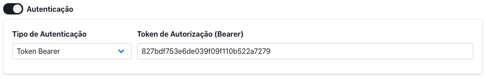

# Webhook

A ferramenta de webhook do Traction serve para enviar uma cópia dos **todos** os leads que entram na ferramenta para um serviço externo através de uma requisição HTTP.

# Cadastro de Webhook

Um webhook pode ser cadastrado através do menu "Webhooks" disponível na ferramenta.






## Gatilho

Gatilho será o evento de disparo do webhook. Há duas opções por enquanto:
 - Lead Criado: Disparo quando um lead for criado no sistema
 - Responsável atrelado: Disparo quando um responsável for vinculado a um lead

## Endpoint

Endpoint é a URL do serviço que receberá a requisição, que poderá ser JSON, FormData ou URLEncode. Se você não tiver certeza de qual selecionar, utilize JSON, a padrão. 

## Mapeamento de Campos 

Caso seja preciso mapear ou filtrar os campos que serão enviados ao web service. Se não for mapeado, todos os campos serão enviados. 

**Exemplo:**


Se for necessário encapsular os campos em um objeto, o caractere ponto deve ser utilizado.

**Exemplo**


[Ver payload de exemplo](#objeto-encapsulado)


## Parâmetros Extra

Também é possível parâmetros de texto estáticos que podem ser utilizados para identificar a origem do lead por exemplo.

**Exemplo:**


## Condições de Exceção

Há também a possibilidade de adicionar algumas condições para o disparo através de regras de exceção. Os disparos podem ser limitados por alguma campanha, canal ou formulário. 

**Exemplo:**


## Autenticação

Caso o web service que irá receber a webhook esteja protegido por alguma autenticação, ela deverá ser feito aqui. 
Existem dois tipos de autenticação HTTP:

- Basic Auth: Schema para autenticação utilizando usuário e senha (ou um token em base64 se necessário)
- Token Bearer: Schema de autenticação utilizando apenas um token

**Exemplo:**


# Exemplo de requisição enviado

## Mapeado
Com mapeamento dos campos *name*, *email* e *phone*

```json
{
  "name": "lorem ipsum",
  "phone": "123456789",
  "email": "lorem@ipsum.com"
}
```

## Sem mapeamento
Todos os campos serão enviados

```json
{
  "name": "lorem ipsum",
  "email": "lorem@ipsum.com",
  "phone": "123456789",
  "campaign": null,
  "forms": "Teste API",
  "channel": "Direto",
  "status": null
}
```

## Objeto encapsulado

```json
{
  "person": {
    "name": "lorem ipsum",
    "phone": "123456789",
    "email": "lorem@ipsum.com"
  }
}
```