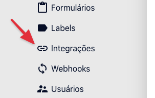

# Webhook

A ferramenta de webhook do Traction serve para enviar uma cópia dos **todos** os leads que entram na ferramenta para um serviço externo através de uma requisição HTTP.

# Cadastro de Webhook

Um webhook pode ser cadastrado através do menu "Webhooks" disponível na ferramenta.




## Endpoint

Endpoint é a URL do serviço que receberá a requisição, que poderá ser JSON, FormData ou URLEncode. Se você não tiver certeza de qual selecionar, utilize JSON, a padrão. 

## Mapeamento de Campos 

Caso seja preciso mapear ou filtrar os campos que serão enviados ao web service. Se não for mapeado, todos os campos serão enviados. 

## Parâmetros Extra

Também é possível parâmetros de texto estáticos que podem ser utilizados para identificar a origem do lead por exemplo.

## Autenticação

Caso o web service que irá receber a webhook esteja protegido por alguma autenticação, ela deverá ser feito aqui. 
Existem dois tipos de autenticação HTTP:

Basic Auth: *Schema* para autenticação utilizando usuário e senha (ou um token em base64 se necessário)
Token Bearer: *Schema* de autenticação utilizando apenas um token. 

# Exemplo de requisição enviado

## Mapeado
Com mapeamento dos campos *name*, *email* e *phone*

```json
{
  "name": "lorem ipsum",
  "phone": "123456789",
  "email": "lorem@ipsum.com"
}
```

## Sem mapeamento

```json
{
  "name": "lorem ipsum",
  "email": "lorem@ipsum.com",
  "phone": "123456789",
  "campaign": null,
  "forms": "Teste API",
  "channel": "Direto",
  "status": null
}
```